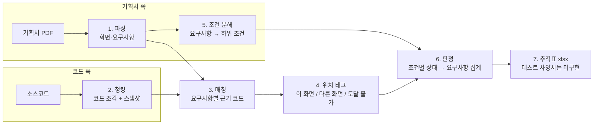

# SpecPilot Backend

화면 기획서와 소스코드를 대조해, 기획서의 요구사항이 코드에 구현됐는지 자동으로 판정하는 파이프라인이다.
판정마다 근거 코드 위치를 붙여, 사람이 결과를 검증할 수 있게 하는 것이 목표다.

설계 배경과 원칙은 [CLAUDE.md](CLAUDE.md), 판정 기준은 [docs/label-definition.md](docs/label-definition.md)에 있다.

## FastAPI 서버

Python 3.11 이상에서 실행한다. 기존 CLI 엔진 옆에 프로젝트별 HTTP API를 기능별로 추가한다.

```bash
python3 -m venv .venv
source .venv/bin/activate
pip install -r requirements-dev.txt
python -m uvicorn api.main:app --host 127.0.0.1 --port 8000 --reload
```

Swagger: <http://127.0.0.1:8000/docs>. 현재 연결된 기능은 `/api/v1/capabilities`에서 확인한다.
기본 DB는 `.data/api.sqlite3`이며 `SPECPILOT_DATABASE_URL`로 PostgreSQL URL을 설정할 수 있다.
업로드 원본은 `.data/uploads/`에 저장한다. `SPECPILOT_WORKSPACE_ROOT`로 허용 프로젝트 루트를 지정한다.
AI 호출은 연결하지 않았으며 키를 저장하지 않는다. 일본어 번역과 다중 모델 지원은 제외한다.
API의 `api_*` 테이블은 기존 CLI 샘플 테이블과 분리한다. 현재는 로컬 개발용이며 인증·운영 마이그레이션은 미구현이다.

현재 구현 범위:

- [FastAPI 서버와 프로젝트 관리 기반 추가](docs/api-core.md)

검증: `python -m pytest -q`, `python -m ruff check api services tests`.

## 기존 CLI 분석 엔진의 파이프라인



| # | 단계 | 하는 일 | 결과 테이블 | LLM |
|---|---|---|---|---|
| 1 | 파싱 | 기획서 PDF에서 화면과 요구사항(Description 0,1,2… / Action A,B,C…)을 뽑는다 | `screen`, `requirement` | - |
| 2 | 청킹 | 코드를 메서드·함수·템플릿 블록 단위로 자르고 분석 시점을 고정한다 | `snapshot`, `chunk` | - |
| 3 | 매칭 | 요구사항마다 관련 코드 조각을 고른다 | `match_run`, `match_result` | O |
| 4 | 위치 태그 | 고른 근거가 그 화면에서 실제로 쓰이는 코드인지 규칙으로 확인한다 | `match_scope_tag` | - |
| 5 | 조건 분해 | 요구사항을 판정 단위인 하위 조건으로 나누고, 정적 검증 가능 여부를 붙인다 | `requirement_condition` | O |
| 6 | 판정 | 조건마다 구현됨·부분·불일치·없음을 정하고 요구사항 단위로 집계한다 | `condition_verdict`, `requirement_verdict` | O |
| 7 | 출력 | 판정 결과를 추적표·테스트 사양서(xlsx)로 낸다 | `output/*.xlsx` | - |

## 기존 CLI 진행 상태

| 단계 | 상태 |
|---|---|
| 1 ~ 5 | 완료. 씽크트리 샘플(Spring, React) 기준으로 실행 결과가 DB에 있음 |
| 6 판정 | 두 레포 전체 실행 완료. 다만 재실행 시 약 14%가 바뀔 만큼 흔들림 |
| 7 출력 | 요구사항 추적표 완료. 씽크트리 견본 형식의 테스트 사양서는 미착수 (시험절차·계정·입력값 생성 필요) |
| 정확도 평가 (골든셋) | 두 레포 전체 480개 조건 정답 완료(샘플 앱 실행 확인). 점수는 `docs/golden-score.md` |
| 로컬 LLM 전환 | 미착수. 사용자 PC 사양·모델 미정 |

## 기존 CLI 설치

```bash
python3 -m venv .venv
source .venv/bin/activate
pip install -r requirements.txt

brew install tesseract tesseract-lang   # OCR 엔진 (시스템 설치, Python 패키지 아님)
brew install postgresql@17              # 이미 있으면 생략
createdb specpilot
psql -d specpilot -f db/schema.sql
```

LLM을 쓰는 단계(3, 5, 6)는 API 키가 필요하다. `.env`는 `.gitignore`에 들어 있어 커밋되지 않는다.

```bash
echo 'ANTHROPIC_API_KEY=<키>' > .env
# 선택: SPECPILOT_LLM_PROVIDER=anthropic, SPECPILOT_LLM_MODEL=claude-opus-5 (비우면 이 기본값)
```

## 기존 CLI 실행 순서

씽크트리 샘플 자료는 `specpilot_projects_share/`에 두고 쓴다 (고객 자료라 `.gitignore`로 제외).

```bash
# 1. 기획서 파싱 → screen, requirement
python db/load_screens.py "specpilot_projects_share/한성대 specpilot 기획서 ver0.2.pdf"

# 2. 코드 청킹 → snapshot, chunk (경로는 반드시 각 앱의 레포 루트)
python db/load_code.py specpilot_projects_share/specpilot spring-sample
python db/load_code.py specpilot_projects_share/specpilot-react react-sample

# 3. 매칭 (레포마다)
python scripts/run_match.py full_context spring-sample

# 4. 근거 위치 태그 (레포마다, 3의 결과에 붙음)
python scripts/tag_scope.py spring-sample

# 5. 조건 분해 (레포와 무관, 기획서 기준 한 번)
python scripts/run_decompose.py
# (verifiable 기준만 바뀌었을 때: 분해 대신 기존 조건만 재분류. 골든셋 연결 유지)
python scripts/reclassify_verifiable.py --dry-run

# 6. 판정 (레포마다, 3·4·5의 최근 실행을 입력으로 씀)
python scripts/run_verdict.py spring-sample

# 7. 요구사항 추적표 → output/traceability_<날짜>.xlsx (LLM 없음. output/은 git 제외)
python scripts/export_trace.py
```

LLM 단계는 실행마다 비용이 든다. 샘플 기준 매칭 약 $0.5~0.6 (레포당), 조건 분해 약 $1, 판정 약 $2.5 (레포당, 캐시 적용).

보조 스크립트

| 스크립트 | 용도 |
|---|---|
| `scripts/run_extract.py <pdf>` | 파싱 결과를 DB 없이 콘솔과 `/tmp/screens.json`으로 확인 |
| `scripts/inspect_pdf.py` | PDF 좌표 디버깅 |
| `scripts/show_scope.py <repo> [화면ID]` | 화면 범위에 어떤 코드가 들어가는지 확인 |
| `scripts/compare_scope.py <repo>` | 매칭 근거가 화면 범위 안에 드는지 비교 (범위 규칙 점검용) |
| `scripts/run_match.py screen_scope <repo>` | 화면 범위로 후보를 좁힌 뒤 매칭 (지금은 안 씀, 로컬 LLM 대비) |

## 단계별 설명

### 1. 파싱 (`extractor/`, `db/load_screens.py`)

- 기획서 PDF의 `화면ID`, `작성자`, `Depth`는 텍스트가 아니라 도형으로 그려져 있어 직접 추출되지 않는다.
  직접 추출이 비면 그 좌표를 잘라 OCR로 읽고 신뢰도를 남긴다
- 요구사항의 `stable_key`는 `LOGIN-001-2`, `NOTICE-002-A`처럼 화면ID와 기획서 번호로 만든다
- OCR 결과가 의심스러우면 자동으로 고치지 않고 `screen.needs_review`에 사유를 남긴다

### 2. 청킹 (`chunker/`, `db/load_code.py`)

- tree-sitter로 구문 트리를 읽어 자른다. 줄 번호가 정확해야 판정 근거 위치를 믿을 수 있기 때문이다
  - Java: 클래스 헤더(어노테이션+선언부) / 메서드 / 필드. 폼·DTO의 `@Size` 같은 제약이 필드에 있다
  - JS/JSX: 함수·컴포넌트 + 최상위 문장(Express 라우트, 상수). 파일 전체를 감싸는 익명 콜백은 안쪽을 다시 나눈다
  - Thymeleaf: form, table, nav 같은 블록
  - yml/properties/sql: 파일 전체를 하나로
- 청크끼리 겹치지 않는다. LLM이 후보 중 하나를 고를 때 같은 코드가 두 번 나오면 선택이 모호해진다
- `snapshot_id`는 파일 내용 해시 트리다 (샘플이 git 저장소가 아님). `chunk.file_path`는
  `snapshot.root_path` 기준 상대경로라 루트를 바꿔 적재하면 안 된다
- 다시 적재하면 chunk id가 바뀌어 그 스냅샷의 매칭·판정 결과도 함께 지워진다 (FK cascade)

### 3. 매칭 (`matcher/`)

- 화면 하나당 LLM 호출 하나. 레포 청크 전체를 후보로 주고, 요구사항마다 관련 청크의 **id만 고르게** 한다.
  LLM이 파일 경로나 줄 번호를 만들어내지 못하게 하려는 것이다 (CLAUDE.md 원칙1)
- 응답은 형식이 맞아도 다시 검증한다. 후보에 없는 id, 빠뜨린 요구사항은 `match_issue`에 남긴다

### 4. 위치 태그 (`matcher/scope/`, `scripts/tag_scope.py`)

- LLM은 화면이 불러오지도 않는 코드를 근거로 고를 때가 있다 (예: 마이페이지 비밀번호 토글에 로그인 화면용 스크립트)
- 화면의 진입 파일에서 "이 코드가 쓰는 코드" 방향으로 규칙으로 따라가 화면 범위를 만들고, 근거마다
  `this_screen` / `other_screen` / `unreachable`을 붙인다
  - 따라가는 연결: 이름 참조, 컨트롤러→템플릿, 템플릿→스크립트·폼 제출 대상, React HTTP 호출→Express 라우트,
    JPA 생명주기 메서드, 프레임워크 인터페이스 구현체
  - 따라가지 않는 연결: 링크·리다이렉트 (다른 화면 이동)
- 화면ID → 진입 파일은 `matcher/scope/entries/<repo_id>.json`에 사람이 적는다. 팝업은 띄우는 화면의 파일로 둔다

### 5. 조건 분해 (`decomposer/`)

- 요구사항 번호 하나에 조건이 여럿 섞여 있어(NOTICE-001-1은 10개 이상) 조건 단위로 판정한다
- LLM이 조건을 나누되 조건마다 **기획서 원문을 그대로 인용**하게 하고, 코드가 원문과 대조한다.
  공백과 PDF 기호 글리프는 양쪽에서 지우고 비교한다
  - 원문에 없는 인용 → 지어낸 조건 의심 / 어느 인용에도 안 걸린 원문 → 누락 의심 (`decompose_issue`)
- 조건마다 `verifiable`을 붙인다. 색·정렬 같은 시각 스타일, 캘린더처럼 브라우저가 제공하는 동작만 검증 불가
- 본문이 같은 요구사항(화면마다 반복되는 34건)은 한 번만 분해하고 복사한다. 같은 문장이 다르게 나뉘지 않게

### 6. 판정 (`verdict/`)

라벨 정의서의 판정 순서를 그대로 따른다.

| 순서 | 조건 | 결과 | 방식 |
|---|---|---|---|
| 1 | 정적 검증 불가 조건 | `not_statically_verifiable` | 규칙 |
| 2 | 매칭 출력 검증 실패 | `needs_review` | 규칙 |
| 3 | 이 화면 근거 없음 (다른 화면 코드만 있으면 `needs_review`) | `not_found` | 규칙 |
| 4~6 | 이 화면 근거 코드를 보고 판단 | `implemented` / `partial` / `mismatch` / `not_found` / `needs_review` | LLM |

- 판정 기준은 전부 `verdict/rules.py` 한 곳에 있다. 기준이 바뀌면 이 파일만 고친다
- LLM에는 그 화면 모든 요구사항의 "이 화면" 근거를 합쳐서 넘긴다. 매칭이 요구사항마다 근거를 일부 놓쳐도
  같은 화면 다른 요구사항에서 찾은 코드로 보완된다. 1~3단계 규칙은 요구사항 자기 근거로 판단한다
- LLM은 이 화면 근거 중에서만 근거를 고르고, 다른 화면 코드는 참고로만 본다. 프롬프트에 화면 이름을 넣어
  다른 화면 문장을 복사한 듯한 기획서 오류를 알아챌 수 있게 한다
- 문구 일치 여부, 서버 검증 유무, 기획서 의심 사유는 상태와 별도 필드로 남긴다
- 같은 입력(조건, 근거 코드, 프롬프트, 모델)의 이전 판정이 있으면 LLM을 다시 부르지 않는다
- 요구사항 상태는 조건 판정의 집계다: 하나라도 불일치면 `mismatch`, 섞여 있으면 `partial`
- 화면 근거는 그 화면 호출마다 같으므로 프롬프트 캐시에 둔다. 화면끼리는 동시에(`--workers`, 기본 5),
  한 화면 안에서는 순서대로 호출해야 캐시가 걸린다. 두 레포 전체가 약 7분, 약 $5

### 7. 출력 (`scripts/export_trace.py`)

판정 결과를 요구사항 추적표(`output/traceability_<날짜>.xlsx`)로 낸다. LLM을 쓰지 않는다.

| 시트 | 내용 |
|---|---|
| 요약 | 상태별 건수(수식), 어느 판정 실행 결과인지(실행 번호, 스냅샷, 모델, 프롬프트 버전), 상태 설명 |
| 요구사항 | 요구사항별 원문과 Spring·React 판정 |
| 조건_Spring / 조건_React | 조건별 판정, 판정 이유, 근거 코드(`파일:줄`), 다른 화면 참고 코드, 문구·서버 검증·기획서 의심 |

- 레포마다 요구사항 전체를 판정한 가장 최근 실행을 쓴다
- 조건 시트의 노란 "정답 (골든셋)" 칸은 샘플 앱을 실행해 확인한 결과를 사람이 고르는 곳이다
- 결과에 기획서 원문과 샘플 코드 경로가 들어가므로 `output/`은 git에서 제외한다. 공유는 따로 한다
- 씽크트리 견본 형식의 테스트 사양서(시험절차·예상결과·계정·입력값)는 아직 없다. 판정 데이터에 없는
  시험 절차와 테스트 데이터를 생성하는 단계가 필요하다

## 골든셋 (정확도 평가)

골든셋은 판정을 채점하는 답안지다. 사람이 샘플 앱을 실행해 조건이 실제로 구현됐는지 확인하고 정답을 적으면,
판정과 비교해 정확도를 낸다. 프롬프트나 규칙을 바꿨을 때 나아졌는지 이걸로 확인한다.

```bash
python scripts/golden.py worksheet          # 확인용 엑셀 (기본: 최근 두 전체 판정에서 결과가 바뀐 조건)
# 엑셀의 노란 "정답" 칸을 채운다 (안내 시트에 앱 실행법·계정·기준이 있음)
python scripts/golden.py import output/golden_worksheet_<날짜>.xlsx
python scripts/golden.py score              # 레포별 최근 전체 판정의 일치율, 결함 검출, 상태별 결과 (-v: 틀린 판정 목록)
python scripts/golden.py score --runs spring-sample=11 react-sample=12   # 특정 판정 실행 채점
```

- 채점은 판정을 시도한 조건만 대상으로 한다. `not_statically_verifiable`로 분류된 조건은 따로 세고,
  그중 실제 결함 수를 함께 출력한다 (결함을 범위 밖으로 빼서 점수가 오르는 효과가 숨지 않게)
- 점수 기록은 `docs/golden-score.md`
- 정답에는 `needs_review`를 쓰지 않는다. 기능이 기획과 다른 화면에 있으면 `mismatch`, 없으면 `not_found`
- 이미 정답이 있는 조건은 다음 워크시트에 다시 나오지 않는다. `--all`이면 전체 조건
- 정답은 `golden_label` 테이블에 쌓인다. 조건 분해를 다시 돌리면 새 조건이 새 id로 추가되고 판정도 새 조건을 쓴다.
  이전 정답은 지워지지 않지만 새 판정과 연결이 끊겨 채점에 안 잡히니, 정답을 채운 뒤에는 분해를 다시 돌리지 말 것
  (원문 인용 기준으로 정답을 새 조건에 옮기는 기능은 아직 없다)
- verifiable 기준만 바뀌었을 때는 분해를 다시 돌리지 말고 `scripts/reclassify_verifiable.py`로 기존 조건의
  verifiable만 다시 매긴다 (`--dry-run`으로 먼저 확인). 바뀐 내역은 `verifiable_change` 테이블에 남는다.
  골든셋은 읽지 않는다

## 디렉터리

```
extractor/      기획서 PDF 파서
chunker/        언어별 코드 청커 (Java, JS/JSX, Thymeleaf)
llm/            LLM 호출 (백엔드 교체는 여기만)
matcher/        요구사항 ↔ 코드 매칭, scope/ 는 화면 범위 규칙
decomposer/     요구사항 → 하위 조건 분해, 원문 인용 대조
verdict/        판정 규칙(rules.py)과 LLM 판정(judge.py)
db/             스키마와 적재 스크립트
scripts/        단계별 실행 스크립트
docs/           라벨 정의서
output/         추적표 xlsx (git 제외)
```

## 설계 원칙 (요약)

자세한 근거는 CLAUDE.md 5장.

- **LLM은 좌표를 만들지 않고 고른다.** 파일 경로·줄 번호는 항상 DB 조인으로 얻는다
- **분석 시점을 고정한다.** 모든 결과는 `snapshot_id`에 묶인다
- **LLM 출력은 형식이 맞아도 다시 검증한다.** 운영에서 쓸 로컬 LLM은 출력 형식을 강제하지 못한다
- **사람 검수는 기획서 쪽 의심 구간에만.** 파싱 신뢰도, 원문 인용 불일치, 누락 의심이 검수 큐로 간다
- **근거는 항상 배열이다.** 요구사항 하나의 근거는 여러 파일에 흩어지는 게 정상이다

## 기존 CLI의 알려진 한계

- 헤더 좌표는 샘플 PDF 템플릿 기준 고정값이다. 다른 레이아웃의 기획서는 좌표를 다시 잡아야 한다
- OCR 신뢰도가 높아도 오독이 있다 ("마이페이지" → "파이페이지"가 신뢰도 0.948). 신뢰도만으로 거르지 못한다
- 입력은 PDF만 된다. PPTX·Word·Excel 파서는 아직 없다
- yml/properties는 파일 전체가 청크 하나다. 키 단위 분리는 값 비교 규칙엔진이 필요해지면 한다
- 테스트 코드와 CSS는 청킹하지 않는다. 테스트에 언급됐다고 구현됨이 나오면 오탐이고, CSS는 검증 불가 영역이다
- LLM 결과는 같은 입력에도 실행마다 다르다. 판정 프롬프트를 바꿔 전체를 다시 돌렸을 때 요구사항 206건 중 28건이
  바뀌었고, 일부는 같은 관찰에서 다른 결론을 낸 것이었다. 같은 입력은 해시로 재사용하지만, 정확도는 골든셋으로 재야 한다
- 추적표 요약 시트의 건수는 수식이라 엑셀이 열 때 계산한다. 계산하지 않는 뷰어에서는 비어 보일 수 있다
- 판정 기준은 잠정이고 샘플 1종에서 나온 사례로 정했다. Q5~Q7은 씽크트리 확인이 필요하다
- `requirement.req_type`(기능/비기능)은 아직 분류하지 않아 NULL이다
